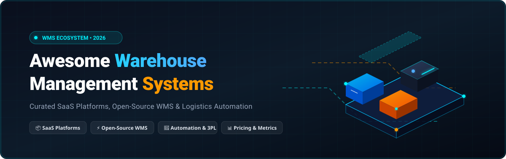
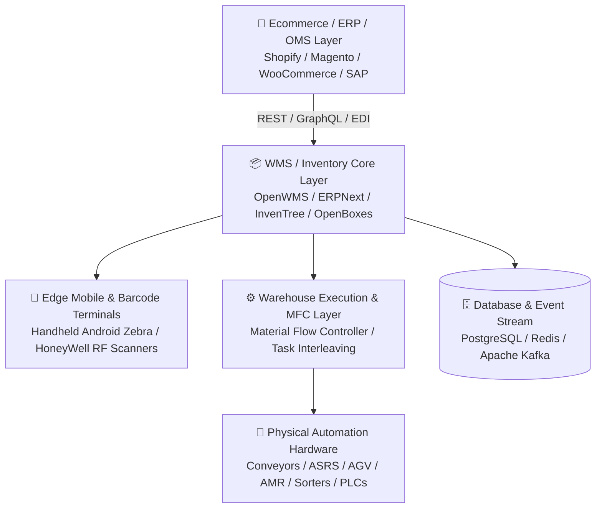

# Awesome-Warehouse-Management

 

### 🏭 The Definitive Ecosystem of Warehouse Management Systems (WMS), Inventory Control & Supply Chain Automation

**Curated Catalog of SaaS Enterprise Solutions & Open-Source Projects**  
*Covering WMS, Inventory Tracking, Order Fulfillment, Pick-Pack-Ship, 3PL Operations, Material Flow Control (MFC) & Barcode Automation*

**📅 Last updated: August 2026**

---

## 📑 Table of Contents

- [🔍 Overview & SEO Highlights](#-overview--seo-highlights)
- [📦 Top SaaS / Hosted Warehouse Management Platforms](#-top-saas--hosted-warehouse-management-platforms)
- [⚡ Top Open-Source WMS & Inventory Projects](#-top-open-source-wms--inventory-projects)
- [🏗️ Open-Source WMS Architecture](#-open-source-wms-architecture)
- [❓ Frequently Asked Questions (FAQ)](#-frequently-asked-questions-faq)
- [🤝 How to Contribute](#-how-to-contribute)
- [⭐ Star History](#-star-history)
- [📜 License & Disclaimer](#-license--disclaimer)

---

## 🔍 Overview & SEO Highlights

**Warehouse Management Systems (WMS)** are mission-critical software platforms that control and optimize day-to-day warehouse operations. From receiving, put-away, slotting, inventory tracking, batch and serial tracking, to wave picking, packing, multi-carrier shipping, 3PL client billing, and robotics/automation orchestration (WCS/MFC).

### 🎯 Key Target Use Cases:
- **E-Commerce & DTC Fulfillment:** High-velocity picking, pack verification, and carrier rate shopping (Shopify, Amazon, WooCommerce, BigCommerce).
- **Third-Party Logistics (3PL):** Multi-tenant inventory separation, automated customer billing, customer self-service portals.
- **Enterprise & Distribution Centers:** Complex cross-docking, automated storage & retrieval systems (ASRS), conveyor integrations, labor management.
- **Self-Hosted & Open-Source Operations:** Modular ERP-integrated inventory, air-gapped security, customized barcode workflows, and hardware integration.

---

## 📦 Top SaaS / Hosted Warehouse Management Platforms

*Ranked in **descending order** by company valuation / market capitalization / revenue.*

| # | 🏢 Platform | 📝 Description & Core Strengths | 💰 Company Size / Valuation | 🏷️ Starting Pricing | 🎁 Free Tier / Free Trial Limits |
|---|---|---|---|---|---|
| 1 | **[Microsoft Dynamics 365 Supply Chain Management](https://www.microsoft.com/dynamics-365/products/supply-chain-management)** | Enterprise cloud ERP & WMS with automated warehouse execution, mobile barcode apps, advanced wave & cluster picking, and robotics integration. | **~$3.1T Market Cap** ($245B+ Annual Revenue) | **$210 / user / month** (Base license; $30/user/mo attach license) | **30-day free trial** with pre-configured guided warehouse demo scenarios |
| 2 | **[Veeqo](https://www.veeqo.com/)** | Free multi-channel ecommerce shipping and inventory platform owned by Amazon with barcode scanning, batch picking, and shipping rate discounts. | **~$2.2T Market Cap** (Parent: Amazon) | **$0 / month** (100% free core shipping & inventory platform) | **Free forever plan** with unlimited users, unlimited shipments, and up to 5% cashback in shipping credits |
| 3 | **[Oracle Warehouse Management Cloud](https://www.oracle.com/scm/logistics/warehouse-management/)** | Cloud-native enterprise WMS providing end-to-end inbound, inventory management, cross-docking, wave fulfillment, and real-time labor analytics. | **~$420B Market Cap** ($53B+ Annual Revenue) | **~$1,500 / month** (Base tier / ~$60 per user/mo equivalent) | **30-day trial** with $300 in Oracle Cloud credits + interactive live guided sandbox demo |
| 4 | **[NetSuite WMS](https://www.netsuite.com/portal/products/erp/warehouse-management.shtml)** | Native cloud ERP warehouse add-on offering RF barcode scanning, receiving, multi-order picking, cycle counts, and real-time inventory visibility. | **~$420B Market Cap** (Parent: Oracle; NetSuite ~$3B+ ARR) | **~$1,999 / month** ($999 base ERP + ~$1,000/mo WMS module) | **14-day free trial** provisioned through certified NetSuite solution partners |
| 5 | **[SAP Extended Warehouse Management (EWM)](https://www.sap.com/products/scm/extended-warehouse-management.html)** | Industry-standard enterprise WMS for high-volume logistics hubs, automated conveyors, ASRS, slotting, and SAP S/4HANA supply chain ecosystems. | **~$240B Market Cap** ($36B+ Annual Revenue) | **~$2,000 / month** (Included Basic EWM in S/4HANA or cloud document tiers) | **30-day free trial** via SAP Cloud Test Drive & sandbox environment |
| 6 | **[Sage X3](https://www.sage.com/)** | Mid-market and enterprise ERP with native inventory, warehouse movements, multi-location stock tracking, purchasing, and distribution control. | **~$12.5B Market Cap** (£2.5B / ~$3.2B Annual Revenue) | **~$2,000 / month** (Starting packages from ~$75–$150 / user / month) | **30-day guided trial** and sandbox environment available through certified partners |
| 7 | **[Manhattan Active Warehouse Management](https://www.manh.com/products/warehouse-management)** | Tier-1 cloud-native enterprise WMS delivering real-time execution, gamified labor management, automated slotting, and robotics/automation orchestration. | **~$10.5B Market Cap** ($1.08B Annual Revenue) | **~$2,500 / month** (Starting base packages typically ~$30,000+/year) | **Custom 30-day proof-of-concept pilot** & guided enterprise interactive sandbox |
| 8 | **[Odoo Inventory](https://www.odoo.com/app/inventory)** | Integrated double-entry inventory and warehouse management app supporting multi-warehouse, automated replenishment, cross-docking, and barcode rules. | **~$9.3B Valuation** (€8.6B Valuation / €650M ARR) | **$0 / month** (One App Free) or **$24.90 / user / month** (All Apps) | **Free forever plan** for 1 App (unlimited users on Odoo Online); **15-day free trial** for multi-app suite |
| 9 | **[Blue Yonder Warehouse Management](https://blueyonder.com/solutions/warehouse-management)** | Enterprise supply chain execution platform with dynamic wave planning, machine-learning task interleaving, labor optimization, and robotics hub. | **~$8.5B Valuation** ($1.42B Revenue; Subsidiary of Panasonic) | **~$2,500 / month** (Site-based deployments typically starting at $30k–$80k/yr) | **30-day assisted POC trial** and interactive guided simulation sandbox |
| 10 | **[Mintsoft](https://www.mintsoft.co.uk/)** | Cloud-based order and warehouse management platform built specifically for 3PL fulfillment houses and fast-growing multi-channel ecommerce merchants. | **~$12B Valuation** (Parent: The Access Group; £1.5B Revenue) | **£159 / month** (~$205/mo for ecommerce; £375/mo for 3PLs) | **14-day free trial** / guided product sandbox tour upon request |
| 11 | **[Infor WMS](https://www.infor.com/solutions/scm/warehouse-management)** | Modern 3D warehouse visualization WMS with advanced labor tracking, wave execution, multi-facility control, and automated material handling support. | **~$3.5B Annual Revenue** (Koch Industries subsidiary) | **~$1,200 / month** (CloudSuite user tiers starting at ~$150/user/month) | **30-day interactive demo** & guided proof-of-concept trial sandbox |
| 12 | **[Körber WMS / HighJump](https://www.koerber-supplychain.com/)** | Adaptable enterprise WMS platform engineered for complex supply chains, cold storage, 3PL logistics, and warehouse automation environments. | **~$3.4B Annual Revenue** (€3.1B Körber Group Revenue) | **~$1,500 / month** (Modular base deployment contracts starting ~$20,000/yr) | **30-day guided proof-of-concept** and interactive pilot demo sandbox |
| 13 | **[Easy WMS (Mecalux)](https://www.mecalux.com/software/warehouse-management-system)** | Versatile warehouse management software optimized for manual and automated storage installations, picking routes, and ecommerce inventory flow. | **~$1.5B Annual Revenue** (Mecalux Group) | **~$800 / month** (SaaS cloud subscription tier) | **30-day assisted demo trial** & interactive warehouse simulation setup |
| 14 | **[Tecsys Elite WMS](https://www.tecsys.com/)** | Supply chain platform optimized for healthcare networks, high-service retail distribution, third-party logistics, and complex warehouse hubs. | **~$330M Market Cap** (CAD 445M; CAD 193M ARR) | **~$1,200 / month** (Base enterprise tiers starting at ~$15,000/year) | **30-day guided sandbox pilot** with pre-configured health/retail workflows |
| 15 | **[Extensiv 3PL Warehouse Manager](https://www.extensiv.com/)** | Purpose-built 3PL management software handling client billing, customer self-service portals, multi-client inventory, and carrier integrations. | **~$500M Valuation** ($100M+ ARR) | **$599 / month** (Core 3PL warehouse plan; Integration Mgr starts at $39/mo) | **14-day trial** for Order Manager; **30-day free trial** for Integration Manager |
| 16 | **[Cin7 Core & Omni](https://www.cin7.com/)** | Multi-channel inventory, warehouse routing, B2B portal, and automated order fulfillment platform connecting ecommerce, POS, and distribution centers. | **~$500M Valuation** ($80M+ ARR; backed by Rubicon) | **$349 / month** (Standard plan; $325/mo billed annually) | **14-day free trial** with full platform feature access and sample catalog data |
| 17 | **[ShipHero WMS](https://shiphero.com/)** | Dedicated high-volume ecommerce warehouse management platform offering batch & wave picking, iOS barcode scanner apps, and automation routing. | **~$250M Valuation** ($50M+ ARR) | **$1,850 / month** (Standard WMS including 5 users; $150/mo per extra user) | **30-day trial** / risk-free pilot period with full warehouse workflow access |
| 18 | **[Deposco Bright Warehouse](https://deposco.com/)** | Unified omnichannel supply chain platform combining WMS, DOM (distributed order management), labor tracking, and carrier rate shopping. | **~$200M Valuation** ($45M+ ARR) | **~$1,500 / month** (Base packages starting at ~$18,000/year) | **30-day customized pilot trial** and structured proof-of-concept environment |
| 19 | **[SkuVault Core (Linnworks)](https://www.skuvault.com/)** | Ecommerce inventory and warehouse management system with real-time sync, bin location management, barcode receiving, and quality control picking. | **~$150M Valuation** (Parent: Linnworks; $35M+ ARR) | **$299 / month** (Core inventory & scanning tier; ~$3,588/year) | **14-day free trial** via Linnworks platform with live barcode scanning testing |
| 20 | **[Fishbowl Inventory & Drive](https://www.fishbowlinventory.com/)** | Warehouse and manufacturing inventory control solution with QuickBooks/Xero integrations, barcode tracking, work orders, and multi-location management. | **~$100M Valuation** ($35M+ ARR; Diversis Capital) | **$329 / month** (Fishbowl Drive cloud starting tier) | **14-day free trial** with complete warehouse and manufacturing module access |
| 21 | **[Logiwa WMS](https://www.logiwa.com/)** | Cloud-native, high-volume ecommerce and 3PL fulfillment WMS featuring AI-powered wave creation, automation rules, and open REST APIs. | **~$100M Valuation** ($20M+ ARR) | **$500 / month** (Volume-based starter tier with unlimited users) | **14-day guided pilot** + free AI proof-of-concept optimization test |
| 22 | **[Made4net](https://www.made4net.com/)** | Scalable supply chain execution and WMS platform (WarehouseExpert) supporting complex Tier-1 to Tier-3 distribution centers and 3PL networks. | **~$100M Valuation** ($25M+ ARR; Apax Partners) | **$500 / month** (Cloud subscription starter packages from ~$6,000/yr) | **30-day proof-of-concept demo** and virtual sandbox configuration |
| 23 | **[InfoPlus WMS](https://www.infopluscommerce.com/)** | Cloud warehouse operating system for direct-to-consumer brands and 3PL warehouses with custom billing rules, smart wave planning, and building controls. | **~$50M Valuation** ($15M+ ARR) | **$695 / month** (Starter brand tier; $1,000/mo for 3PL plan) | **14-day guided trial** and interactive sandbox walkthrough |
| 24 | **[Snapfulfil](https://www.snapfulfil.com/)** | Tier-1 architecture cloud WMS offering rapid remote deployment, rule-based picking, spatial slotting, and automated material handling integrations. | **~$30M Valuation** ($12M+ ARR; Synergy Logistics) | **$800 / month** (Entry subscription tier including up to 5 users) | **14-day assisted pilot** & live interactive warehouse workflow simulation |
| 25 | **[CartonCloud](https://www.cartoncloud.com/)** | Integrated WMS and TMS (Transport Management System) engineered for 3PL providers, cold chain logistics, automated invoicing, and mobile driver apps. | **~$30M Valuation** ($10M+ ARR) | **$430 / month** (Starter tier based on usage volume) | **14-day guided discovery trial** & interactive live operational demo |
| 26 | **[Shipedge](https://shipedge.com/)** | Modular supply chain and warehouse management software designed for ecommerce 3PLs, cross-docking, multi-channel orders, and returns processing. | **~$25M Valuation** ($8M+ ARR) | **$500 / month** (Tier 1 plan for up to 1,500 orders/month) | **14-day trial** / personalized solution engineer test session |

---

## ⚡ Top Open-Source WMS & Inventory Projects

*Ranked in **descending order** by GitHub Star count. Each star badge directly links to that project's stargazers.*

| # | 🌟 Project & Repo | ⭐ Github_Stars | 📋 Tech Stack & Focus | 💡 Key Capabilities |
|---|---|:---:|---|---|
| 1 | **[Odoo](https://github.com/odoo/odoo)** |  | **Python / JavaScript / PostgreSQL** *Enterprise & WMS Suite* | Double-entry inventory management, multi-warehouse routing, cross-docking, drop-shipping, barcoding, wave picking, and MRP integration. |
| 2 | **[ERPNext](https://github.com/frappe/erpnext)** |  | **Python / JavaScript / MariaDB** *Full ERP & Warehouse Stack* | Serial & batch tracking, stock ledger, multi-location bin allocation, automated replenishment, purchase receipts, and delivery notes. |
| 3 | **[Snipe-IT](https://github.com/snipe/snipe-it)** |  | **PHP / Laravel / MySQL** *Asset & Inventory Tracking* | Barcode & QR code scanning, asset check-in/check-out, physical location tracking, consumable inventory counts, and audit logs. |
| 4 | **[Grocy](https://github.com/grocy/grocy)** |  | **PHP / SQLite / JavaScript** *Micro-Inventory & Stock ERP* | Barcode scanning, stock intake, expiration date tracking, location bin management, recipes/BOM, and RESTful API endpoints. |
| 5 | **[Frappe Framework](https://github.com/frappe/frappe)** |  | **Python / TypeScript / MariaDB** *Low-Code Business Engine* | The foundational web framework for building custom WMS apps, automated warehouse workflows, and REST/GraphQL APIs. |
| 6 | **[InvenTree](https://github.com/inventree/InvenTree)** |  | **Python / Django / Vue.js** *Modular Part & Stock WMS* | Multi-level location trees, serial number tracking, barcode labeling, bill of materials (BOM), supplier parts, and mobile app support. |
| 7 | **[Dolibarr ERP CRM](https://github.com/Dolibarr/dolibarr)** |  | **PHP / JavaScript / MariaDB** *Modular Inventory Platform* | Warehouse stock transfers, replenishment thresholds, batch/lot management, shipping slip generation, and order dispatching. |
| 8 | **[Shelf.nu](https://github.com/shelf-nu/shelf.nu)** |  | **TypeScript / Next.js / Supabase** *Modern Asset & Stock WMS* | Dynamic QR code generation, instant mobile scanning, team custody management, warehouse item tracking, and open REST APIs. |
| 9 | **[PartKeepr](https://github.com/partkeepr/PartKeepr)** |  | **PHP / Symfony / MySQL** *Electronic & Component Stock* | Bin/shelf coordinate storage, distributor part number matching, parameter search, and inventory valuation reports. |
| 10 | **[Apache OFBiz](https://github.com/apache/ofbiz-framework)** |  | **Java / Groovy / PostgreSQL** *Enterprise Automation ERP* | Comprehensive warehouse facility definitions, wave picking, inventory reservations, multi-channel fulfillment, and packing rules. |
| 11 | **[ADempiere](https://github.com/adempiere/adempiere)** |  | **Java / React / PostgreSQL** *Supply Chain & ERP Suite* | Material management, multi-warehouse locator grids, physical inventory counts, purchase orders, and distribution logistics. |
| 12 | **[OpenBoxes](https://github.com/openboxes/openboxes)** |  | **Groovy / Grails / MySQL** *Healthcare & Global Supply Chain* | Lot & expiration tracking, stock movement requisitions, cross-facility transfers, cold chain monitoring, and electronic packing lists. |
| 13 | **[OpenWMS.org](https://github.com/openwms/org.openwms)** |  | **Java / Spring Boot / Angular** *Enterprise Intralogistics & MFC* | Warehouse Execution System (WES), transport order management, Material Flow Control (MFC), PLC hardware connectors, and conveyor routing. |
| 14 | **[iDempiere](https://github.com/idempiere/idempiere)** |  | **Java / OSGi / PostgreSQL** *Modular Enterprise Business Engine* | Multi-organization warehouse management, automated replenishment algorithms, inventory valuation, and procurement tracking. |
| 15 | **[OCA WMS Modules](https://github.com/OCA/wms)** |  | **Python / Odoo OCA ecosystem** *Advanced WMS Odoo Extensions* | Wave management, dispatch channel splitting, advanced reservation algorithms, shop-floor scanning screens, and transport packaging. |
| 16 | **[Great Blue WMS](https://github.com/infiniteoo/wms)** |  | **Python / Django / React** *Modern Web & Mobile WMS* | Lightweight warehouse operational toolkit covering basic inbound receipting, bin allocation, pick list generation, and dispatch. |
| 17 | **[Sentry WMS](https://github.com/hightower-systems/sentry-wms)** |  | **Node.js / Vue / PostgreSQL** *Barcode-First Execution System* | Designed around handheld RF barcode scanners for receiving, put-away, wave picking, packing stations, and courier label printing. |
| 18 | **[Tryton](https://github.com/tryton/tryton)** |  | **Python / PostgreSQL** *Modular High-Reliability ERP* | Warehouse shipment planning, internal stock moves, product lead times, inventory reordering rules, and lot traceability. |

---

## 🏗️ Open-Source WMS Architecture

Building an enterprise-ready, self-hosted warehouse execution ecosystem typically combines the following software layers:

---

## ❓ Frequently Asked Questions (FAQ)

<b>1. What is the difference between a WMS, WES, and WCS?</b>

 

- **WMS (Warehouse Management System):** Manages overall inventory levels, storage locations, receiving, wave creation, labor assignments, and order fulfillment.
- **WES (Warehouse Execution System):** Dynamically coordinates and prioritizes real-time workflow queues and balances human labor with automation.
- **WCS (Warehouse Control System) / MFC (Material Flow Controller):** Directly communicates with field-level equipment (PLCs, conveyor diverters, ASRS cranes, AMRs, sorters) to execute physical routing.

<b>2. Can open-source WMS platforms replace commercial SaaS systems?</b>

 

Yes! For organizations with software engineering resources, self-hosted open-source platforms like **OpenWMS.org**, **ERPNext**, **InvenTree**, and **OCA WMS** eliminate recurring seat licenses, offer complete data privacy, and allow unlimited deep customization of scanning rules and hardware integrations.

<b>3. Which SaaS WMS platforms provide a 100% Free Tier?</b>

 

- **Veeqo (by Amazon):** 100% free with unlimited shipments, unlimited users, and no monthly fees.
- **Odoo Inventory:** 100% free forever for unlimited users under the "One App Free" plan on Odoo Online.

---

## 🤝 How to Contribute

Contributions, updates, and additions are warmly welcomed! 🚀

1. 🍴 **Fork the repository**
2. 🌿 **Create a new branch** (`git checkout -b feature/add-wms-entry`)
3. 📝 **Add or update entries** following the markdown table structure (include exact links, verified starting pricing, and free trial terms)
4. 📬 **Submit a Pull Request** with a descriptive summary of changes

---

## ⭐ Star History

---

## 📜 License & Disclaimer

- Distributed under the **MIT License**. See `LICENSE` for more information.
- This repository is a **community-curated index** intended for educational, architectural, and operational evaluation. All brand names, logos, and trademarks belong to their respective owners.

  Built with ❤️ for warehouse operators, 3PLs, logistics engineers, and software architects worldwide.

